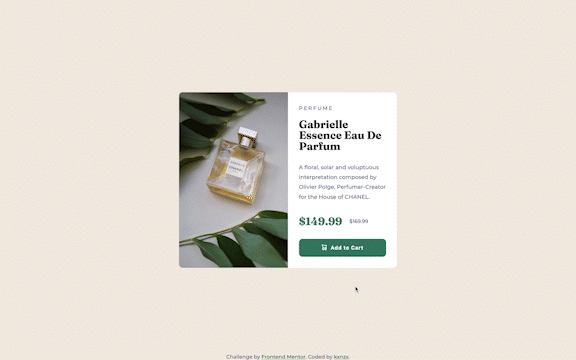
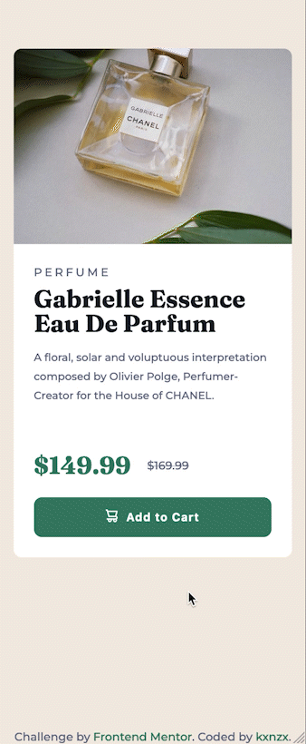

# Frontend Mentor - Product Preview Card Component Solution

This is a solution to the [Product Preview Card Component Challenge on Frontend Mentor](https://www.frontendmentor.io/challenges/product-preview-card-component-GO7UmttRfa). Frontend Mentor challenges help you improve your coding skills by building realistic projects.

## Table of contents

- [Overview](#overview)
  - [The challenge](#the-challenge)
  - [Screenshot](#screenshot)
  - [Links](#links)
- [My process](#my-process)
  - [Built with](#built-with)
  - [What I learned](#what-i-learned)
- [Author](#author)

## Overview

### The challenge

Users should be able to:

- View the optimal layout depending on their device's screen size
- See hover and focus states for interactive elements

### Screenshot

#### Screensize 1440px - Desktop



#### Screensize 375px - Mobile



### Links

- View my Solution on [Frontend Mentor](https://www.frontendmentor.io/solutions/product-card-component-with-css-grid-lXRHqpXQVy)
- View the Live Site [here](https://kxnzx.github.io/product-card-component/)

## My process

- HTML semantics
- Importing Google Fonts
- Set variables
- Reset default settings
- Styles (Mobile First)
- Media Queries

### Built with

- Semantic HTML5 markup
- SASS custom properties
- CSS Grid
- CSS Flexbox
- Mobile-first workflow
- [Google Fonts](https://fonts.google.com/) - For Fonts

### What I learned

I found an easy way to darken and/or lighten a color in scss variables. With the lighten() and darken() function you can easily transform the current color in a darker or lighter shade. For this challenge I needed to darken the background-color of the button in the hover state. I have included a lighter mode in the snippet below as a note to myself. You can increase the darkness or brightness with the percentage.

```scss
$dark_cyan: hsl(158, 36%, 37%);
$dark_cyan_darker: darken($dark_cyan, 10%);
$dark_cyan_lighter: lighten($dark_cyan, 10%);
```

## Author

- Frontend Mentor - [@kxnzx](https://www.frontendmentor.io/profile/kxnzx)
